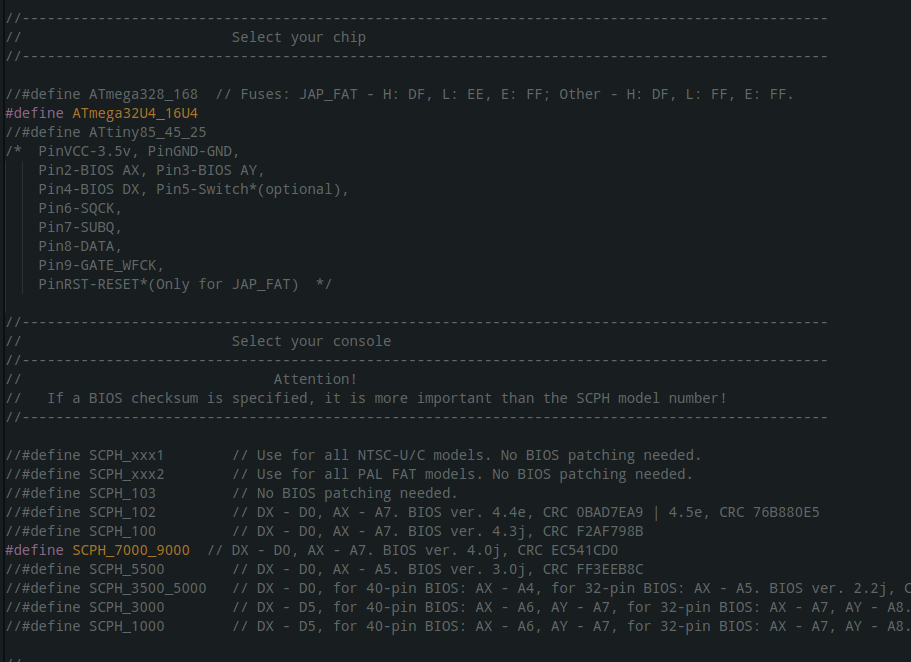
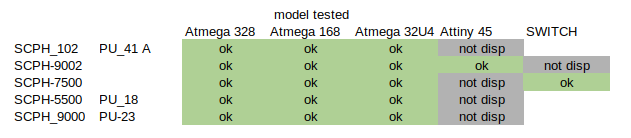

# PSNee V8

The first stealth modchip supporting unlocking BIOS of Japanese versions Sony PlayStation 1

Developed by **brill** & **postal2201**, based on PSNee V7 open source project.  
- http://www.emu-land.net/forum/index.php/topic,85934.0.html

## Supported platforms
PsNee V8.5 supports the following MCU's:  
- ATmega328(A/P/PA) @16Mhz  
- ATmega168(A/P/PA) @16Mhz
- Atmega32U4        @16Mhz
- ATtiny25/45/85    @8Mhz no BIOS patch!

## Installation
Copy PSNee_V8 into your sketchbook
Place the cor folder in your ~arduino15/packages/

Choosing your boadr
tools->board->PSNee 

Choosing your ISP programmer
Tool->programmer

If you need to change fuses 
Tool->Fuses 
Tool->burn bootloader (You get an error message that it could not burn the bootloader, ignore it.)

#In the PSNee_V8.ino file choose your board, and the model of your console

To inject the code into the board
Sketch->upload using a programmer
**Flashing via COM port is not supported.**

### Fuses
Before flashing the MCU, you need to configure the fuses.  
- Fuses for JAP_FAT consoles: **H: DF, L: EE, E: FF**  
- Fuses for all other consoles: **H: DF, L: FF, E: FF**  

## Installation diagram

## model tested

