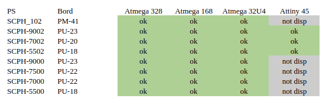

# PSNee V8.5
THE modechip supports the largest number of Playstation 1 variants, and the largest number of microcontrollers

## Features
- Remove Disk Region Protection
- Patch BIOS additional region features
- The mode does not take care of changing PAL <-> NTSC video output

## Supported Playstation 1
All US models, all European models, and the vast majority of Japanese models.

## Supported platforms
- ATmega328(A/P/PA) @16Mhz  
- ATmega168(A/P/PA) @16Mhz
- Atmega32U4        @16Mhz
- ATtiny25/45/85    @8Mhz no BIOS patch!
works in progress
- ATtiny48/88
- LGT8F328 

## Installation
For all useful information consult the PDF

## Model tested

